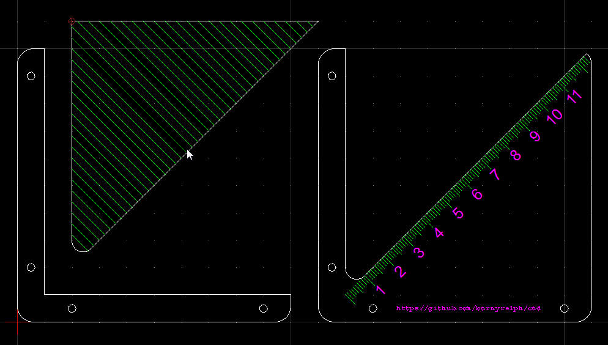

# Centre Finder

I needed to find the centre on some bar stock and didn't have a convenient way to do it, so I knocked up a laser-cut example.

It could be as simple as a 45 degree slope sat on top of a 90 degree square, but wouldn't it be nice if I could also measure the size of the stock quickly. It'd also be nice if I could quickly mark a line at 90 degrees to the first one. 

# Version one

Here's the first version. You sit the finder on the stock and scribe a line along the centre. The insert is designed to fit in the gap. Once you've scribed your centre line, you pop the extra bit in place, rotate your stock until the line is paralel with the scribed lines in the insert, then scribe again. 
It worked, in as much as you could scribe a centre line on bar stock, but suffered a few issues

 * There's a radius right at the origin of the centre line. That's there to try to impart a little strength to the whole assenbly where it's narrowest. It works for that purpose, but it also means you can't scribe a line all the way across your stock unless it's larger than about 50mm
 * The scale is completely wrong. Without thinking about it, I put a literal centimeter scale on the centre line without thinking about whether that'd actually measure the size of the stock. Which it doesn't
 * I forgot to turn the text of my numbers on the scale into lines, so our laser cutter software didn't import any text
 * I forgot that our laser software won't engrave a single line, only a filled area. I'd done all of my scales and 90 degree finder as single lines, so I had to make do with setting the laser to cut, but with only sufficient power to mark the acrylic, which kind-of works, but leaves you with a rough surface.
 * The insert for finding 90 degrees was fiddly to hold in place 